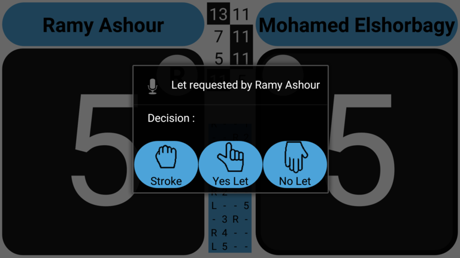
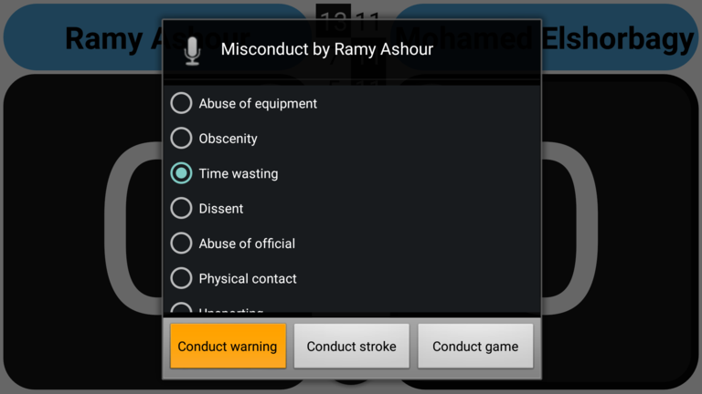

## Appeals and conducts

If you like to have a record of appeals players have made, and the decision you took, you can optionally enter them in this app.
The same for conducts: If you like to have a record of conduct warnings/strokes you have called, you can do that with this app.

### Appeals

When a player makes an appeal (calls for a 'Let') click on that players name.

A dialog will be presented where you can choose `No Let`, `Let` or `Stroke`.

Note that if you choose either 'No Let' or 'Stroke' a point is automatically awarded to the correct player.

### Conducts

When a player makes is misbehaving and you think a conduct warning/stroke is applicable long-click on that players name.

A dialog will be presented where you can choose `Conduct Warning`, or `Conduct Stroke`.
Note that if you choose 'Conduct Stroke' a point is automatically awarded to the other player.

Note: for a doubles match the 'Long-click' on the players name will NOT trigger the 'Conduct' dialog.
It is used to 'Swap' the first and second player of a team.

