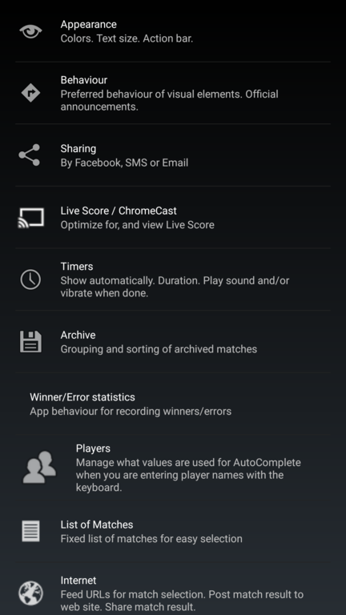

## Settings

In the settings screen of the Squore app you can customize the Squore app to fit your needs.

* Appearance
    * Colors
        * Choose a color palette (predefined or create your own)
        * Backgrounds (choose one of the colors from the color palette for different screen elements)
        * Text colors (idem)
        * Transparency of serve button of receiver
    * Players avatar
        * Show image on (On Device, On ChromeCast)
    * Countries/Flags
        * Show country as (Flag and/or abbreviation after name)
        * Hide flags for same nationality/country
    * Action bar
        * Show the actionbar
        * Show text in the action bar buttons
    * Layout    
        * Full screen option
        * Screen orientation (Landscape and/or Portrait)
        * Show/hide 'old fashioned' paper scoring
        * Scoreline layout (Digits in the middle or Digits on the right)                                <!-- Squore only -->
        * Show tiny match/game duration chronometers     
        * Timer type (Popup or Inline)
        * Show field/division (On Device, On ChromeCast)
            * Hide division field when game in progress
        * Icon size of the hand gestures in 'Appeal' dialog (set to zero to not show the icons)          <!-- Squore only -->
* Behaviour
    * Show _New match_ float button (with a plus sign)
    * Keep screen on (so you don't have to unlock your device after a long rally or pause between games)
        * defaults to 'If Match is in Progress'
        * You can alter it to 'Always' or 'Never'
    * Screen orientation (Landscape and/or Portrait)
    * Save matches for reviewing/continuation later
    * Back key behaviour (Press twice to exit, Press Once to Exit, Undo Score, Undo Score No Confirm, Toggle Serve Side)
    * Volume key behaviour (None, Adjust Score, Adjust Score For Portrait only)
    * Specify a startup action
        * E.g. to always show you pre-defined list of matches as soon as you start the app
    * Number of characters you have to enter before 
        * the 'auto-complete' for players kicks in
        * the 'auto-complete' for countries kicks in
    * End of Game
        * Indicate game-ball by altering colors of the score buttons (checkbox)
        * Show 'Game ball'/'Match ball' message if applicable (checkbox)
        * End the game when score is applicable (Suggest, Do not use, or Automatic)
        * Auto show score details at the end of each game (checkbox)
        * Let the app give haptic feedback (vibrate) when game ends
    * Lock match behaviour
        * Lock match to prevent accidental changes (Auto-lock at end of match, Auto-lock if unchanged for x minutes)
        * number of minutes before match should be auto-locked (disabled if you did not select this option)
    * For more official usage
        * show official announcements (Suggest, Do not use, or Automatic)
            * start of game
            * end of game
            * tie-break
        * announcement language
        * show timers (Suggest, Do not use, or Automatic)
        * Show decision (of appeal or misconduct) as message on screen
        * Official Squash Rule URLs
            * the first one specified will be used for 'Show official squash rules' menu option
    * Others        
        * Use toss feature (Suggest, Do not use, or Automatic) at start of match
        * Let the app give haptic feedback (vibrate) for score changes
* Sharing
    * Use 'Share' feature
    * Action for sharing
        * Sharing a link with the entire match history (default)
        * Share a match summary
        * Post the result to e.g. your clubs website
        * Email a score sheet to a default recipient
        * Text a match summary to a default recipient
    * Default referee name for new matches, (if not empty, visible on shared score sheet)
    * Enter a preferred phone number for sending results to via a text message
    * Enter a default email address to mail the result to
    * Mail full scoring sheet (Yes/No)
* Live Score / ChromeCast
    * Support live scoring (Short cut to quickly adapt settings to more efficiently support live scoring)
    * Live score (URL)
    * Show game scores and score graph of last game during pause
* Timer (see below for more details)
    * Show tiny match/game duration chronometers     
    * Show timers (Suggest, Do not use, or Automatic)
    * Timer type (Dialog with circle or Inline with digits only)
    * Number of seconds for warm-up (officially 4 minutes (240 seconds))                                                               <!-- Squore only -->
    * Number of seconds pause before start of a game (officially 120 seconds)                                                          <!-- Squore only -->
    * Number of seconds you can easily switch between (defaults to 90, 120, 180 and 300, but you can specify other values if you like) 
    * Use sound notifications (checkbox)
    * Use vibration notifications (checkbox)
    * Show info (duration and end-score) of last game in timer dialog (checkbox)
    * Show adjust remaining time buttons (checkbox)
    * Show audio checkbox in timer
    * Show button to pause the timer
    * Hide the timer when time is up
    * Show tiny 'To late' chronometer when pause time has elapsed 
* Archive
    * Save matches for easy consulting later
    * How to group saved/archived matches (By date, By event)
    * How to sort archived matches (Ascending/Descending)
    * Location where import/export of saved/archived matches will store/look for zip files by default (internal sdcard or removable sdcard)
* Statistics                                                                                                                          <!-- Squore only -->
    * Record Rally End Statistics After Each Score (Winner/Error Forehand/Backhand Front/Volley/Back)                                 <!-- Squore only -->
    * What details can entered in the Rally End screen                                                                                <!-- Squore only -->
* Players
    * List of names that is used for 'Auto Completion' player names while you are typing
    * List of club names that is used for 'Auto Completion' club names while you are typing
    * List of names that is used for 'Auto Completion' of referee names while you are typing
    * Number of characters you have to enter before the 'auto-complete' kicks in ( players/clubs and country)
    * Maximum number of players in a group (when entering names/matches for _My List_)
    * Whether or not to use your contacts for auto-complete when entering the names of players of a match (Squore needs access to your contact list for this)
        * Only use a specific group of users for auto-complete
* List of matches
    * Textual format of matches stored for 'Select match from fixed list'
    * Use the Group Name for Event Data (Name and Round optionally separated by a '>')
    * Remove match from My List (Don't, Suggest, Do Automatically)
    * List of event names that is used for 'Auto Completion' event data while you are typing
    * List of round names that is used for 'Auto Completion' round name while you are typing
* Internet related settings
    * Enter selectable 'feed/post' URLs
    * Enter the active 'feed/post' URL
    * What data to post
        * most relevant data only (default)
        * most relevant data + json
        * json only
    * Use Feed Name as 'Event Name' (if checked, the 'headers' in a feed will be used for 'Event Name/Round')
    * Auto suggest to post (available if post URL is specified)
    * Hide matches that have a result specified in the feed
    * Remove seeding from player names selected from feed
    * Switch to list of players if no matches scheduled yet (Automatic, Suggest or Do Not Use)
    * Selectability of tournaments
        * Only if the tournament ended less than P days ago
        * Only if the tournament will start withing F days
        * Only if the tournament last a maximum of L days
    * Misc
        * Prefetch flag images
        * Official squash rule URLs (for easy consultation of official squash rules)                                               <!-- Squore only -->
            * defaults to <http://squore.double-yellow.be/help/rules.of.singles.squash.php>                                        <!-- Squore only -->
        * Use 'Share' feature
    * Technical
        * Maximum Cache Age Feeds
        * Flags URLs
        * Maximum Cache Age flags
* Match format (Note: these settings are automatically changed to use as new defaults if you change them for a new match)
    * Points to win a game (officially 11)
    * Number of games to win a match (officially 3)                                                                                <!-- Squore only -->
    * Tie-break format you want to use (officially 'Two points')                                                                   <!-- Squore only -->
    * If you want to use hand-in/hand-out scoring (officially it is PARS: point-a-rally system)                                    <!-- Squore only -->
    * Allow specifying a handicap (None, Same handicap for all games, Specify new handicap at start of each game)                  <!-- Squore only -->
* Import/Export/Reset settings
    * Import settings from a backup, from an URL, or reset to default
      * Note: you can use a URL from which to fetch settings. Typically used to more easily have all devices for a certain event or league use the same settings.
      * Each time the app starts and such an URL is configured it will try and fetch the latest 'version' of the settings from the URL
      * If you want your settings for you event or league to be available here, let me know

### Appearance

#### Action bar

If you have a relatively small screen you might want to use the option to hide the 'Action Bar'.
In this way more room will be come available for the other buttons of the score board.

Most options the app that you need during a match
* become available at the appropriate time by means of floating buttons
* are available by (long) tapping or swiping the appropriate screen element(s).

But if you quickly want the action bar back into view: long click the game-scores.
(By the way: The same action can be used to hide the action-bar).

### Players

This option contains a list of names that is used for 'Auto Completion' player names while you are typing.
If you have e.g. a text file with all the names of your fellow club mates, you can past it here.
Each line should contain just one name.

Each player name you use for a match is automatically added to this list.
So if you enter `Patrick` as one of the players of a match, the next time you are defining a match and start typing e.g. `Pa`,
the value `Patrick` will be suggested for auto-completion.

### List of matches

This option contains the textual format of matches stored for 'Select match from fixed list'.

Lines starting with a dash represent 'Headers'.
A typical example would be:

    - World Championships 2014 > Semi Finals
    Gregory Gaultier - Ramy Ashour
    Nick Matthew - Mohamed Elshorbagy

    - Tuesday matches with me mates
    James - Richard
    Richard - Steven
    Steven - James

Also note that the name of the Header will be used as 'Event Name' and 'Event Round' if it can be split nicely into two at `>`, `:` or `-` characters contained in the header.

For example: If the app user were to select the Match `Gregory Gaultier - Ramy Ashour` from the section/header `World Championships 2014 > Semi Finals` that
the 'Event' of the match would become _World Championships 2014_ and the 'Round' would become _Semi Finals_
