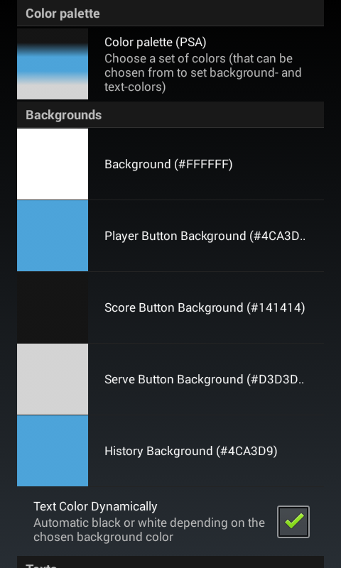
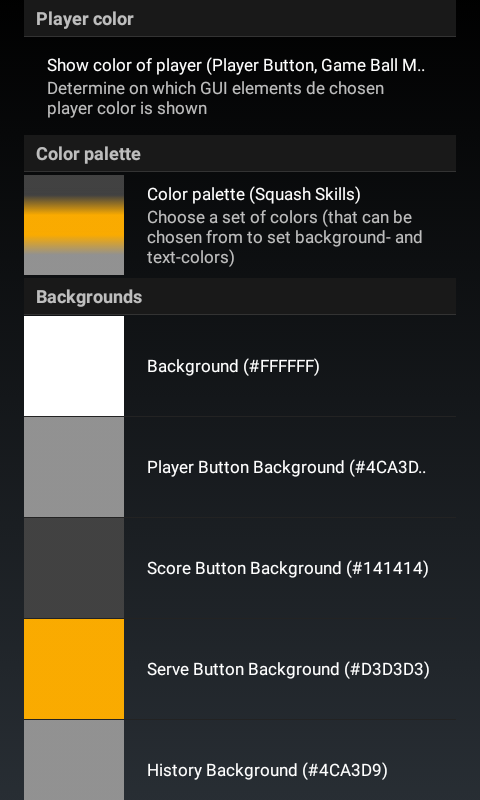
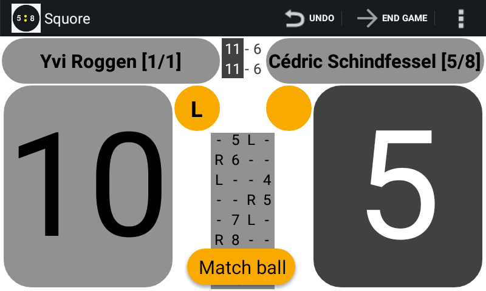

## Colors

If you do not like e.g. the default colors, you can simple choose a different 'Color Palette' in the 'Settings/Colors'
section. Simply by selecting a different palette the app will get a different look and feel.
The 3 colors of a palette together with the 'colors' black and white will be used now.

By default the color of the text on buttons will be either black or white, depending on the background color for the button.
(for light background colors, black letters will be used, for dark background colors, white letters will be used).

If you are still not satisfied with the look and feel after changing the active Color Palette you have a few more options:
* You might want to change the default 'background' assignment.
* You might want to add your own color palette

Adding your own color palette can be done by pressing the 'New...' entry in the select list of possible color palettes.
A dialog will appear in which you can 'name' your own color palette and specify the three colors that will make up your palette.

Colors should be specified in `#RRGGBB` format.

If one of the available color palette is not to your liking you may delete it. This is done by
* first making the color palette you want to delete the 'Active' color palette.
* after clicking on the 'Color palette' preference, click on the (now preselected) active entry
    * a dialog will appear in which you can choose to delete the entry.

The colorscheme will also be used in a limited way when you share a score sheet to e.g. facebook.

You can also specify a color to a player. More info can be found in [Who-is-who](../match/2.7.player.colors.md)
