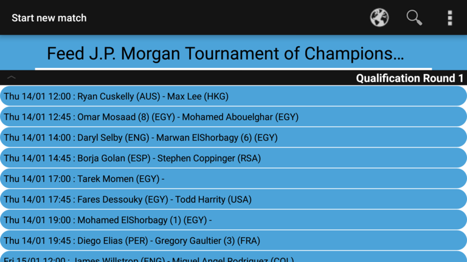
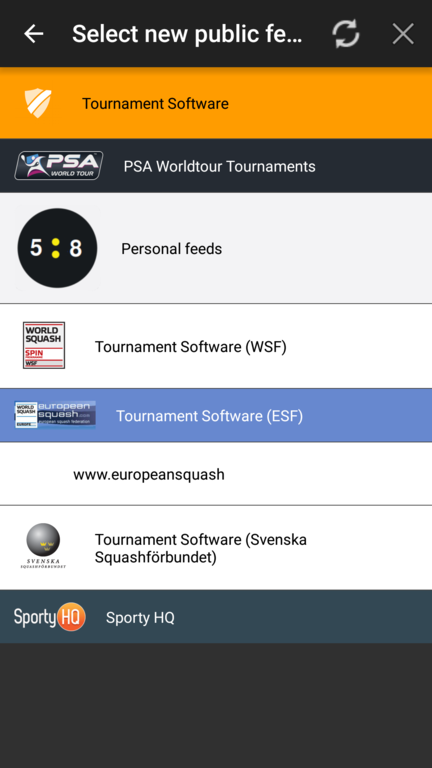
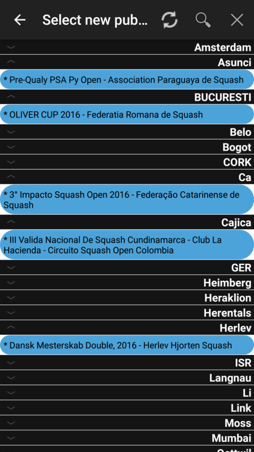
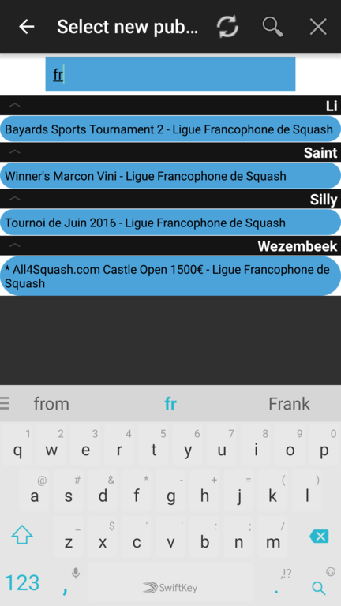

## Feeds

Feeds allow you to quickly select a match that is about to be played that you will be referee-ing.

The __Feed__ tab shows matches from a recent tournament from <https://psaworldtour.com/tournaments> by default, just to show the power of a live feed.

You can click on one of these links to see what the actual feed content looks like
* <http://squore.double-yellow.be/feed/psa.php?nr=1>
* <http://squore.double-yellow.be/feed/psa.php?nr=2>
* <http://squore.double-yellow.be/feed/psa.php?nr=3>
* <http://squore.double-yellow.be/feed/psa.php?nr=4>
* <http://squore.double-yellow.be/feed/tournamentsoftware.php?nr=1>
* <http://squore.double-yellow.be/feed/tournamentsoftware.php?nr=2>
* <http://squore.double-yellow.be/feed/tournamentsoftware.php?nr=3>
* <http://squore.double-yellow.be/feed/tournamentsoftware.php?nr=4>

The above feeds are simple 'plain text' feeds. To have more control over the feeds, the may also be in JSON format.
Examples of such feeds are
* <http://squore.double-yellow.be/demo/demo.matches.json>
* <http://squore.double-yellow.be/demo/demo.matches.blitz.json>
* <http://boxen.double-yellow.be/matches.json.php>

On the __Feed__ tab it is possible to

### Switch between configured feeds

It is quite easy to switch between feeds.
* E.g. on sundays I use my clubs 'private' feed to list matches to be played in my clubs internal competition,
* and on other days I often have a feed from _tournamentsoftware.com_ as my active feed (all Belgian tournaments are hosted on this platform)

### Select a new publicly available feed

A lot of matches are publicly listed on e.g
* <http://www.tournamentsoftware.com/tournamentlist.aspx?id=1>
* <https://psaworldtour.com/tournaments>

The Squore app tries to provide you these matches in the form of feeds for easy selection.

* add one of many available feeds
    * just for showing the power of feeds you can e.g. add a feed of a PSA tournament here
    * more useful are the feeds that show matches of competitions and tournaments near you as they appear in <http://tournamentsoftware.com/tournamentlist.aspx?id=1>
    * if you or your clubs webmaster has defined a feed specific for your club, you can let me know.
      I can add it to the list of 'Personal Feeds' so your fellow clubmembers can easily configure Squore on their device to use this feed.
* switch to the list of players (if the feed has a 'Playerlist' feed, e.g. those from tournamentsoftware.com)
* hide completed matches from the list of matches (with the completed matches the list might become to long to comfortably select a match you have to ref)

It is also possible from the settings screen to modify URLs that the app can use manually.
But clearly this takes a little more effort than selecting it from a list.
