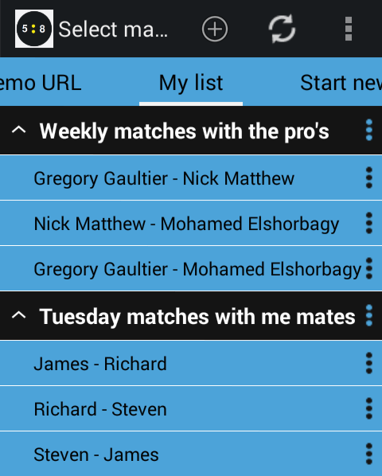
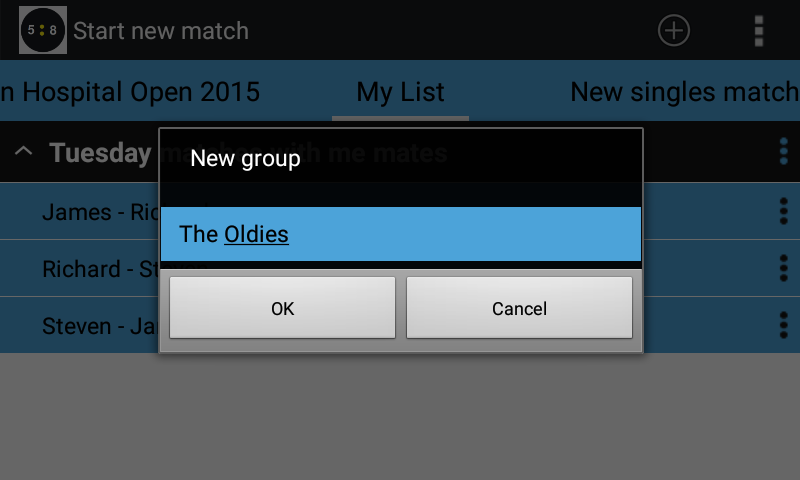
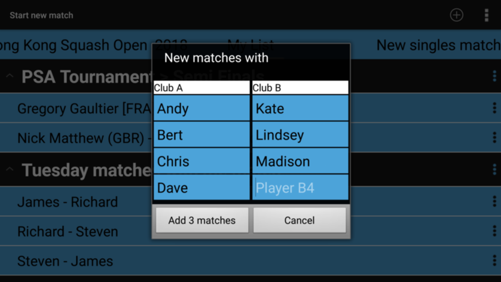
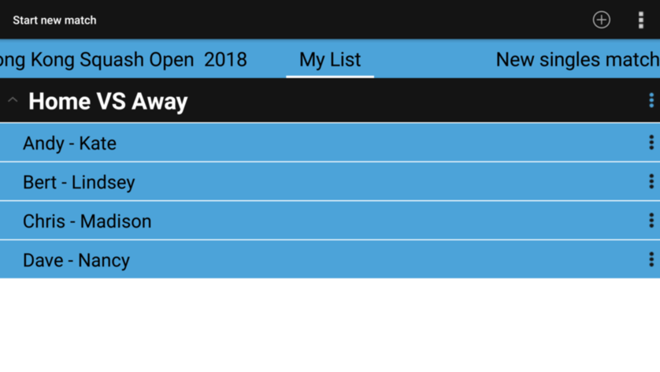
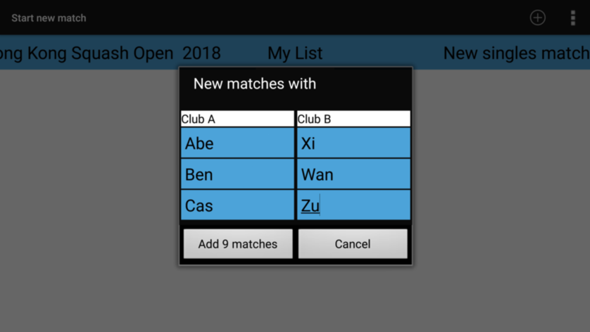
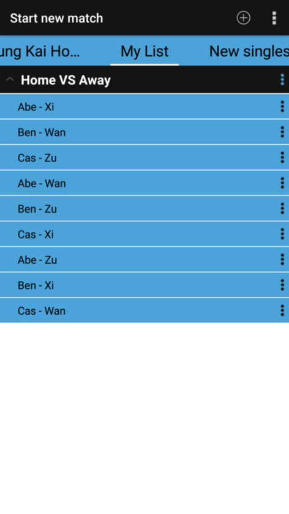
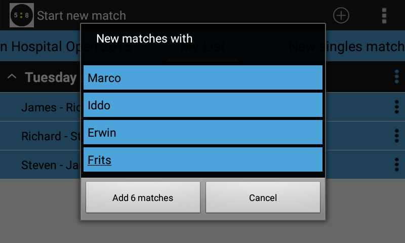
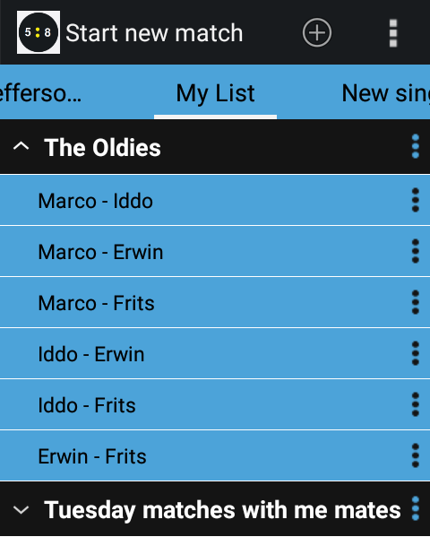
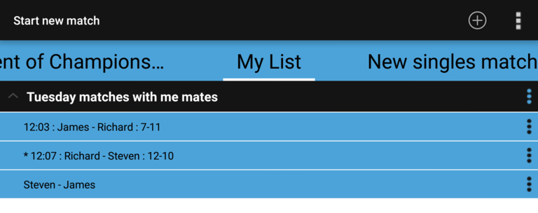

## My List

The __My list__ tab allows you to define matches up front.

For example if you play an interclub match, you can already define all matches to be played.
Or if you play with the same group of friends on a regular basis, you can define these matches up front.
As soon as the actual match is about to start you can simple select it from the list.

If you select 'Add group' you have the option to select matches in 3 different ways.

After specifying the group name, a dialog where you can enter player names is presented.
How that dialog looks depend on the choosen option.

### Team vs Team

If you selected one of the 'Team vs Team' options, in the next dialog you can enter the names of players per team.

After entering the names, the matches are added to my list for easy selection.
Of course the number of matches depends on the option selected in the first dialog.

An example of matches added after 'Team vs Team - One match per team player'

An example of matches added after 'Team vs Team - Multiple matches per team player'

### Poule

If you selected 'Poule', in the next dialog you can enter the names of players who are all supposed to play each other.

(This dialog is also presented if you choose 'New matches' from the popup menu of a header/group)

In the dialog more than 2 text boxes are presented where you can enter player names.
* If you enter just 2 player names, 1 single match will be added.
* If you enter 3 player names, 3 matches will be added (1-2, 1-3, 2-3).
* Similarly if you enter 4 player names, 6 matches will be added. For 5 player names, 10 matches will be added.

### Winner stands

If you play __Winner stands__ with friends (after each game the looser of the game makes places for another player), it is good to know you
can also use the _My List_ functionality. If, after some rotation, you re-select a match between players that already played a game against each other 
just a little earlier, Squore will use the previous score for the 'continuation' of their match.

All matches recently played will also show the current score when the matches are presented in the list

