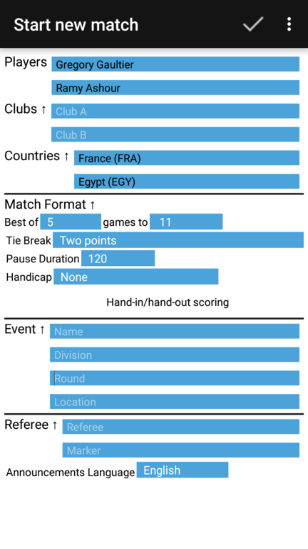
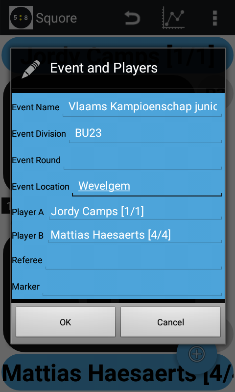

## Specifying the event details and match format

After you have entered (or selected) the names of the players, the Squore app offers you
the option to specify more details of the match. 

Here you can specify

* The clubs the players/teams are playing for
* The country the players/teams are playing for
* Match format details
    * number of sets to play                                <!-- TennisPadel only -->
        * Note: you can toggle between 'Best of' and 'Total of' sets to play                                <!-- TennisPadel only -->
    * number of games per set                               <!-- TennisPadel only -->
    * How you want the final set to finish: may deviate from the initial sets.    <!-- TennisPadel only -->
        * E.g. a longer tiebreak, or                                              <!-- TennisPadel only -->
        * no games and a deciding tiebreak immediatly                             <!-- TennisPadel only -->
    * number of games to be played                          <!-- not for TennisPadel -->
        * Note: you can toggle between 'Best of' and 'Total of' games to play                                <!-- not for TennisPadel -->
    * how many points per game                              <!-- not for TennisPadel -->
    * what format of Tie-break you want to use
        * If you want the tiebreak to start one-game early (e.g. at 5-5 if sets are played to 6 games)        <!-- TennisPadel only    --> 
    * if you want to use Hand-in/hand-out scoring                                                             <!-- not for TennisPadel -->
    * duration of the pause between games
    * When new balls are in order                           <!-- TennisPadel only -->
    * If and what type of Golden Point you want to use      <!-- TennisPadel only -->
    * When a change of sides should occur                   <!-- TennisPadel only -->
    * optionally specify that you play with a handicap system (one player starts with a few points ahead)     <!-- not for TennisPadel -->
        * By default, negative handicap scores are not allowed. If you want to allow negative handicaps you can enable this in _Settings > Match Format > Handicap Score > Allow negative handicap score_     <!-- not for TennisPadel -->
    * If you want to use the 'Live Score' option for this match
* Event/Venue details
    * Name
    * Division
    * Round
    * Location
    * Court
* Referee
    * Name (usually you)
    * Name of the person acting as a marker               <!-- Squore only -->
    * Name of the assessor                                <!-- Squore only -->
    * Announcement language (currently supported are English, French, German, Spanish, Portuguese, Dutch, Czech)

In case of a 'Doubles' match you also have the option to specify the 'Sequence of Serve' used for the doubles match.

Note that if you do not want to specify an event, and the fields are e.g. already pre-filled for you, you can clear them by 'long clicking' on the label `Event`.
(And similarly you can clear the player fields by 'long clicking' the label `Players`, and clear the referee fields by 'long clicking' the label `Referee`.)
Alternatively the menu also offers _Clear player fields_, _Clear event fields_ and _Clear referee fields_ options.

## Correcting mistakes

If you realise that you have spelled a players name incorrectly or one of the event details,
you can simply correct it by choosing the menu option _Edit/Event-Player_.
(Or swipe back-and-forth over one of the player names)

