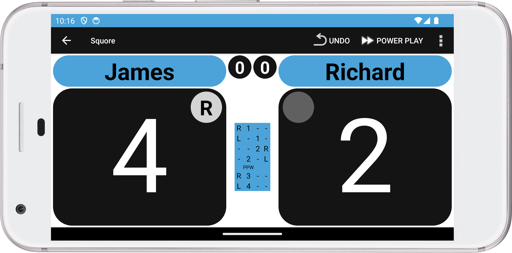
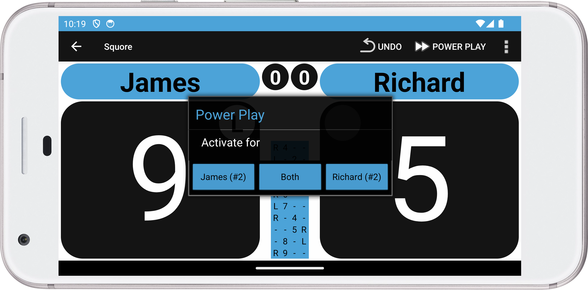
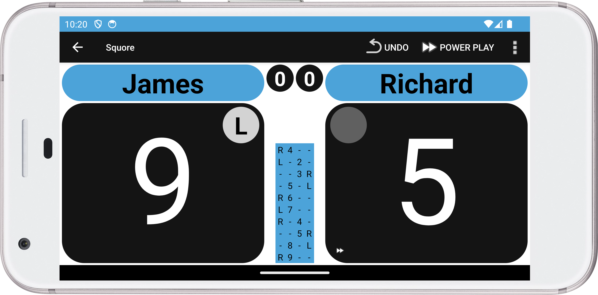
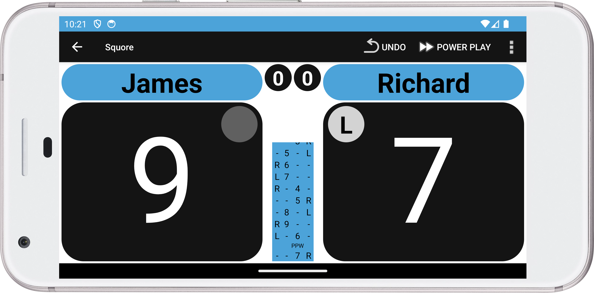

## Powerplay

Powerplay has been implemented (expiremental).
For now you can only enable it under 
`Settings > Match Format > Powerplay`

Once the match is in progress you will have a button 'Powerplay' in the toolbar next to the 'Undo' button.

By pressing the button you will get a dialog in which you can
- see the number of powerplay's a player has left
- activate powerplay for one or both players

Once powerplay is selected for a player a tiny 'fast-forward' icon will be visible within the bottom
of the score button of the player for which powerplay is activated.

As soon as a point is played
- an additional point is added to the winner of the rally if he/she activated powerplay
- within the score history the result of the powerplay is displayed
  - PPW : PowerPlay won
  - PPL : PowerPlay lost
- the tiny 'fast-forward' icon will disappear

