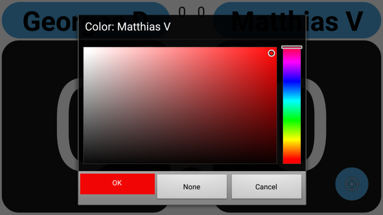
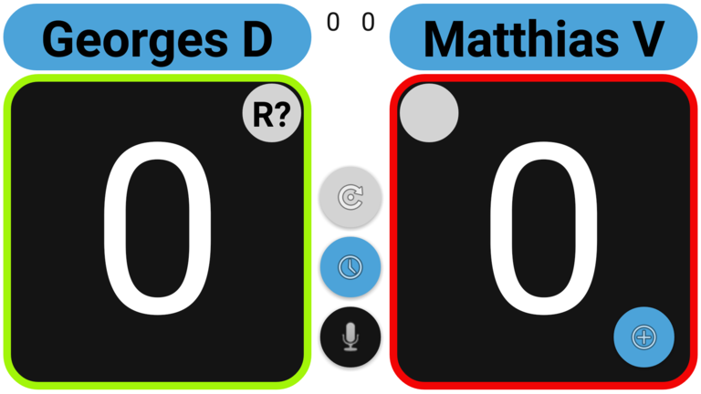
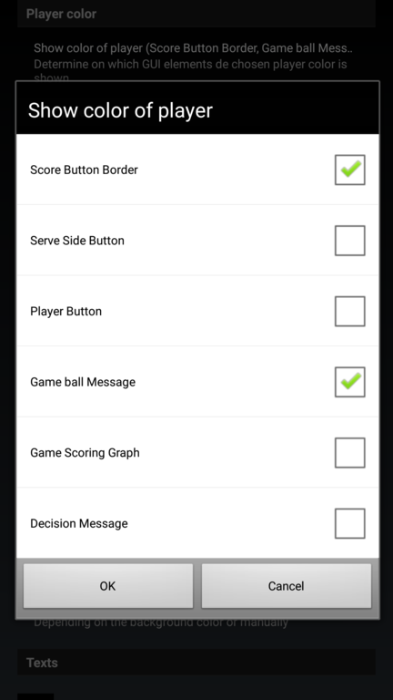

## Use colors to remember who-is-who

If you ref matches at tournaments, it may well happen that you find yourself referee-ing a match were you see both players for the first time.
After entering their names you might have have difficult remembering who-is-who.

To help you remember who is who, you can select a color for one or both players by long-clicking the 'Serve Side' button.
Choose e.g. the color of the shirt, short or shoes a player is wearing.

In the settings screen you can specify where you want the chosen color to appear.
By default it will only appear 'around' the big score buttons.

Additionally, if you simply like having both players to displayed in a different color (not matching any clothing per se) you can manage this
with the following setting: `Settings > Appearance > Colors > Initial colors of players`

