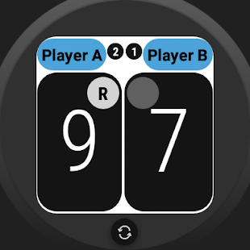
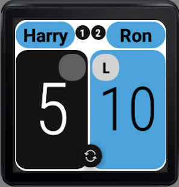

## Wear OS

The app is also available for Wear OS.

If you already have the app installed on your handheld, the easiest way to install it on your wearable
is by selecting the menu item

    Help > Open Playstore on Wearable

and click `Install` on your wearable.

It 'only' has the basic functionality of keeping score.
(Not all functionality is that easy to port to a tiny screen).

## Sync score between paired devices

However if you have the app open on both your handheld device and on your 'paired' wear OS device, the score between
them will be kept in sync.

And because entering details of a new match is often more easy on your handheld you can use this to your advantage.

If the app is running in the foreground already on one of your devices, and you then start it on the second device,
a dialog on your handheld will be opened to ask you what match should be used on both devices:
the one currently on your wearable (**pull**) or the match on your handheld (**push**).

## Adjust score by 'rotating'

It is good to know that, if your wearOs device has a **rotating button** on the side
(or a **bezel**, something that rotates around the face of the watch),
it is also possible to adjust the score with that button by turning it.
Turning it (far enough) in one direction will adjust the score for one player,
rotating it in the opposite direction for the other player.

As soon as a change of score is registered in this way the wearable will vibrate shortly so you also have non-visual feedback. 
To prevent 'errors', you can only change the score again in this way after at least 3 seconds have past.

## Consult current time without leaving the app

If you long-press both score buttons, you will see the current time displayed for a short period of time.
It might be convenient to quickly consult the current time without leaving the scoring app.

