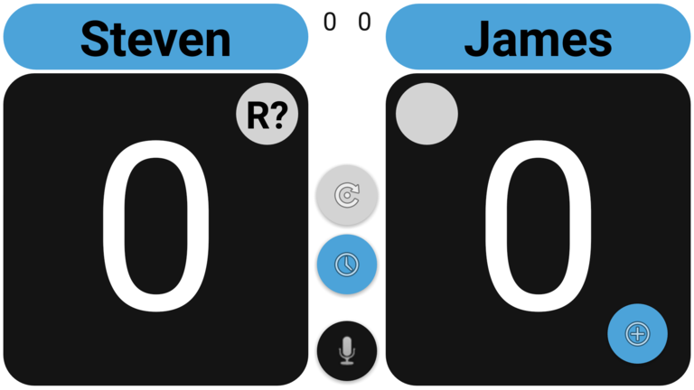
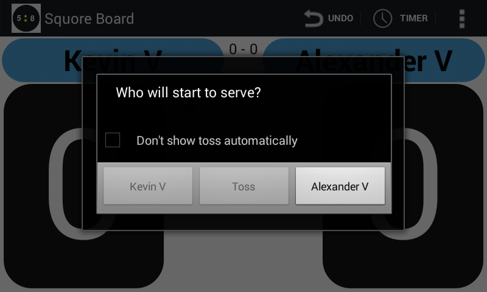

## Warm-up and toss

After confirming the match format, the app will show you the scoreboard with the starting score for the match.
As long as the score is not started you will also be presented with 3 floating buttons
* One to perform a toss
* One to start a timer
* One to show the official announcement to be made at the start of a match

All the 3 floating buttons are shown to you because, by default, the related options in the settings screen are set to 'Suggest' by default.
If you e.g. never use the 'Toss' button you can change the appropriate setting from 'Suggest' to 'Do not use'.
Likewise if you always use a timer, you can change the appropriate setting from 'Suggest' to 'Automatic'.

