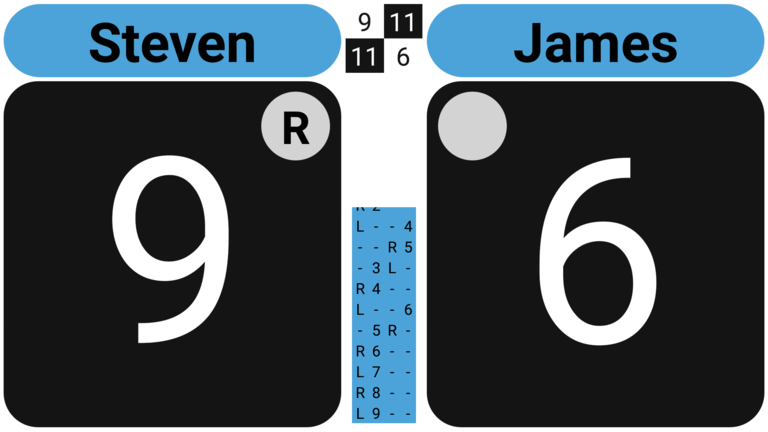
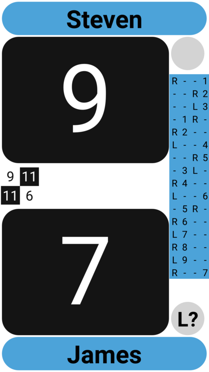
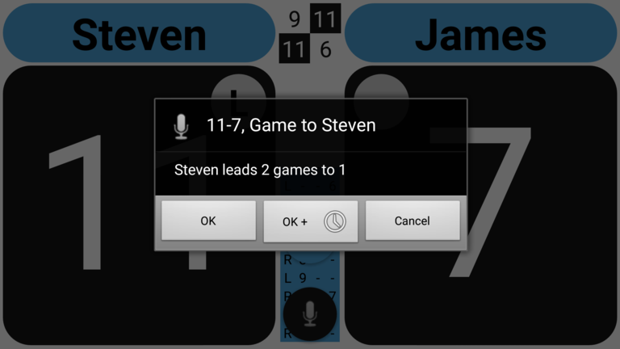
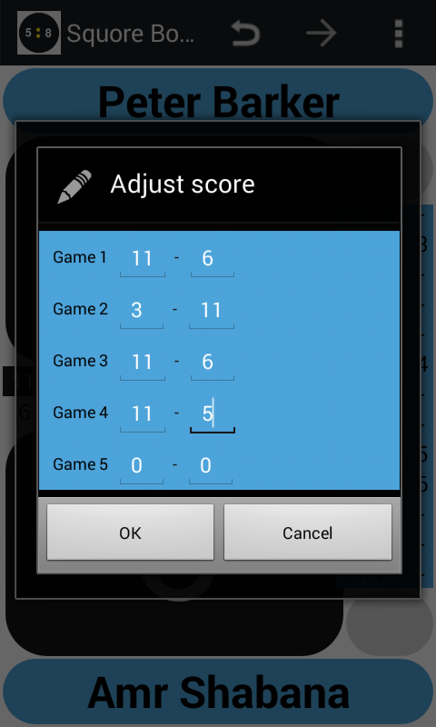

## Keep track of the score and serve side

Simply assign a point to a player by clicking/tapping on the 'score' button located under the players name.

Note that if the player that served also scored the point, the small 'serve side' button
will toggle between 'L' and 'R' appropriately.

And if not, (i.e. the receiver scored the point) and thus it was a so called 'handout', the 'serve side' button
for the receiver (who now becomes the server) becomes active.
Besides that an 'L' or an 'R' is shown (depending on where he/she started serving last) a
question mark '?' is also displayed. This is for you, the referee, so you can clearly see that the last point
was a handout (or not) and thus to let you know whether or not the server has the option to start from either side.
If the server decides to switch sides, simply tab on the button with the 'R' or 'L' to toggle between these two values.

Note that in the middle of the score board a more or less 'old fashioned' score sheet is also maintained.
If you do now find this useful, you can turn it off in the settings screen.

## End of a game

By default the app will suggest to you to end the game if the scoring is a 'game winning' score.
In the 'Settings' you have the option to change this behaviour to:
* _Automatic_  : automatically end the game
* _Suggest_    : show a dialog suggesting you to end the game (default)
* _Do not use_ : do nothing when a game ending score is reached

Note that you can always end the game manually by
choosing the _End game_ menu/action bar option at any moment.

## Correcting mistakes

If you made a mistake and you realise it immediately, choose the _Undo_ button/menu option.

If you made a mistake but don't know exactly where, but still need to correct the current score, choose the _Edit/Adjust Score_ menu option.
A dialog will pop up where you can correct the current scoring (if required of other games as well).
This options can also be used to enter a score for a match already in progress which you will be referee-ing for the remainder of the match.

You can also trigger this dialog quickly by tapping on both score buttons at the same time.

__EOF__

