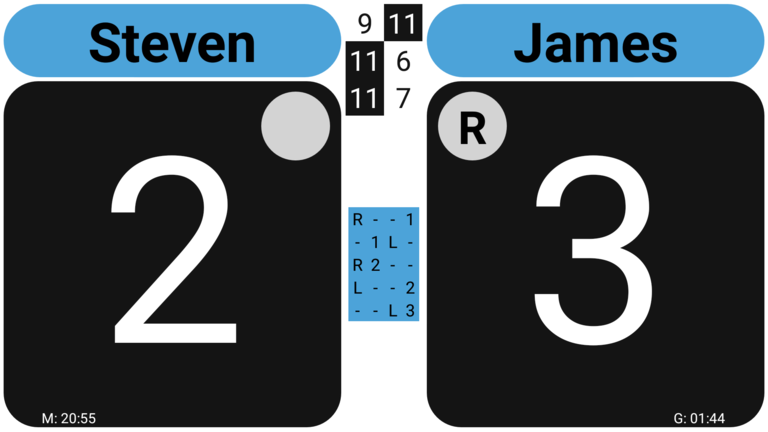
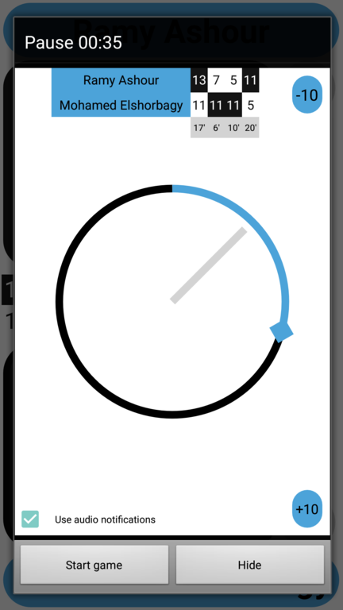
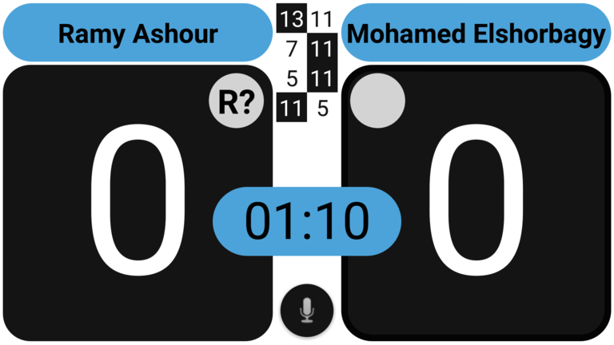
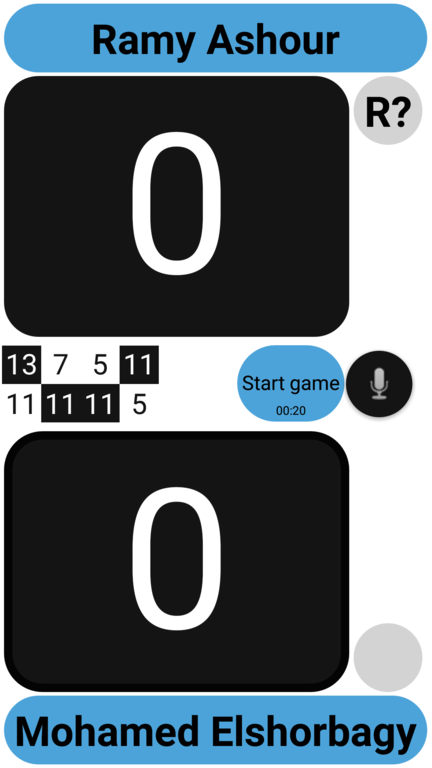

## Timings

For those who want to use the app in a more professional setting, the app has the option to use timers/chronometers.

### Game and match duration

The app can optionally display both the duration of the match as well as the duration of the last game.
To not get in the way of entering scores they will be displayed very tiny at the bottom of the screen.

If you desire you can remove one or both of these chronometers via options in _Settings/Timers/_

### Warmup and pause timers

You can simply start a timer by hitting the 'floating' Timer button (or choosing the 'Timer' menu option).
If the match has not yet started a 'warm-up' count down timer will start.
After the warm-up, and the toss usually has been done, starting another timer will result in the _'next game starts in'_/_'Pause'_ timer

In the 'Settings' screen one choose between 3 options for the 'Show timers' option.
* If you choose 'Suggest' (the default) timers will not start automatically but a floating 'Timer' button will appear when the match starts or a game ends.
* if you choose 'Automatic' timers will automatically appear
    * if you start a new match: the warm-up timer appears
    * the 'next game starts in' timer will automatically appear
        * when the warm-up timer ends
        * when you end a game and more games need to be played.
* If you choose 'Do not use', timers will not start automatically and the floating button will not show at the start of a match/end of a game.
    * If desired you can still start a timer via the main menu: 'Show/Timer'

In most competitions the pause between games used, is 90 seconds. On the more serious tours like the PSA, they increased this to 120 seconds.
The duration of the pause you want to use can be chosen at the beginning of the match.
If you play in a league were even a different duration is used, you can add it to the select list in the 'Timers' section of the preferences screen.

All timers can also be simply cancelled if desired.

If you choose _hide_ in the timer dialog, the dialog will be closed but the timer will keep on running and is now visible
in the main scoreboard.
This allows you to consult e.g. match details while the timer keeps on running in the background.
(To go back to the 'timer dialog' press on the digits of the timer in the scoreboard.)

### Accuracy

To get accurate timings, it is best you use the 'Announcement button' (the one with a microphone) just before the first point of a game is about to start.
This will also set the 'start time' of the game about to start to the time you press this button. 

### To late

Once the pause time has run down to zero, it will display _Start game_ and a tiny chronometer (counting up).
The tiny chronometer allows you to see how long ago the 'time was up', and optionally warn a player if he returns on court much to late.

### Adjust

If desired the remaining time of the timer can be adjusted.
This is done by means of the `-10` (e.g. you accidentally started the timer to late) and `+10` (e.g. you timer was configured to run for 90 seconds, but it should be 120) buttons.
If you don't like these 'adjust' buttons you can disable them via the settings screen.
