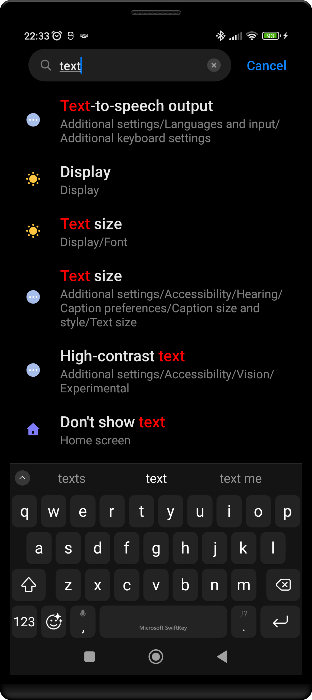
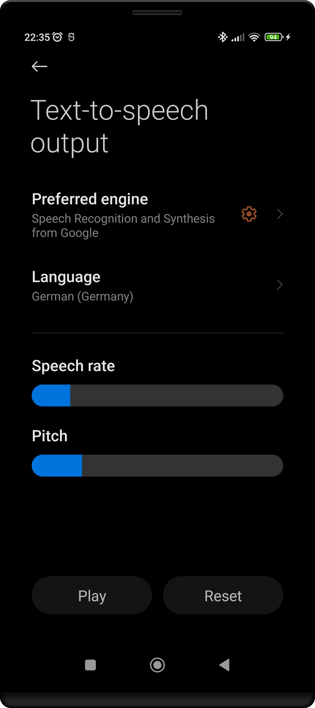
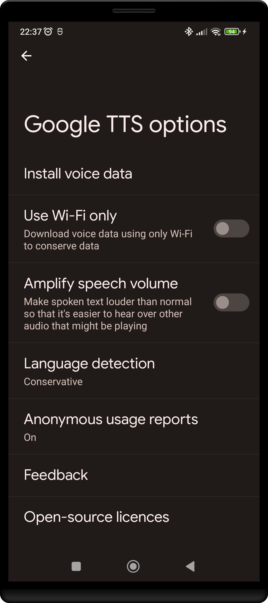
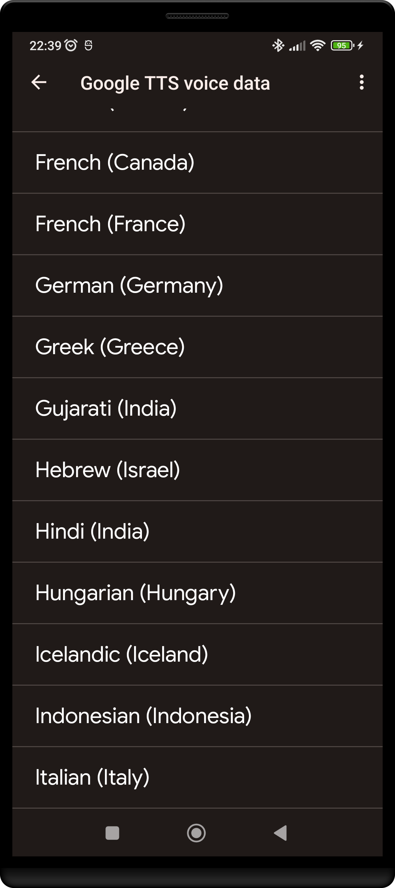
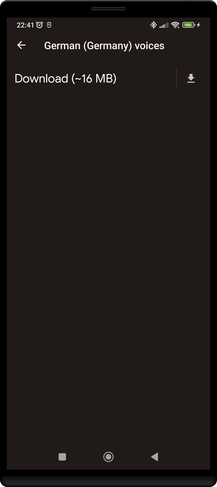
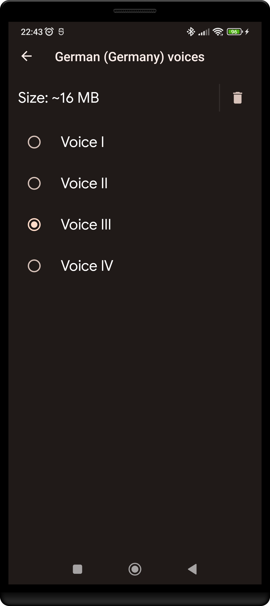

## Speech

For those who like that the app 'speaks' and announces the score, you can enable this option via _Settings/Speech_.

By default this option is set to _Don not use_.

### Suggest

If you set the speech preference to _Suggest_, a speech button will bevisiblee in the actionbar.
The app will say the score only when you press the button

### Automatic

If you set the speech preference to _Automatic_, the app will announce the score after each change in score.  
A speech button will be visible in the actionbar as well.
The app will say the score (again) when you press the button.

### Customize by installing a Voice

The speech feature is implemented using text-to-speech from Google.

To get optimal results you most likely should install a 'voice' of the language
you want it to 'output'.
This can be going to settings and searching for 'text'.
An option 'Text-to-speech output' should appear:

Now next to the 'Preferred engine' there is a settings button (Gear icon):

If you click on that you enter the 'Google TTS options':

There select 'Install voice data' and scroll to your preferred language:

If no voices are listed select the 'Download' icon

After the download has finished you can select one of the voices:

You can use the speech function without installing a 'Voice' but the experience is much better if you do so.

## Other minor adjustments

You can additionally make small modification to the generated voice

- by adjusting either the _Pitch_ and/or 
- the _Rate_ of the speech

You can play around a little with values for these two in the _Settings > Speech_ section.

