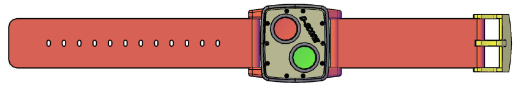
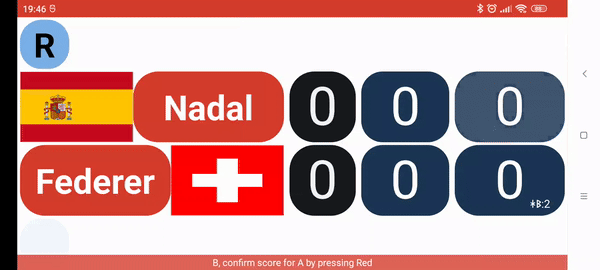
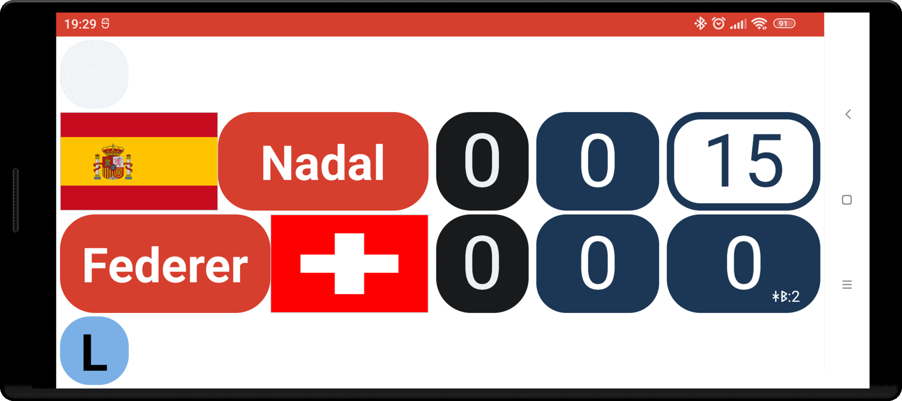
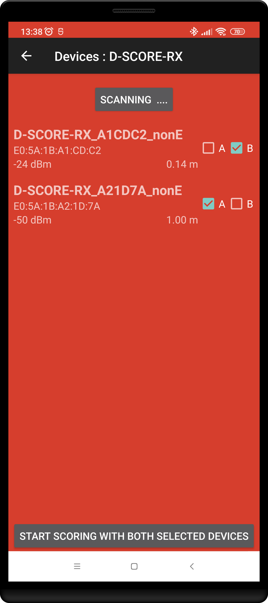
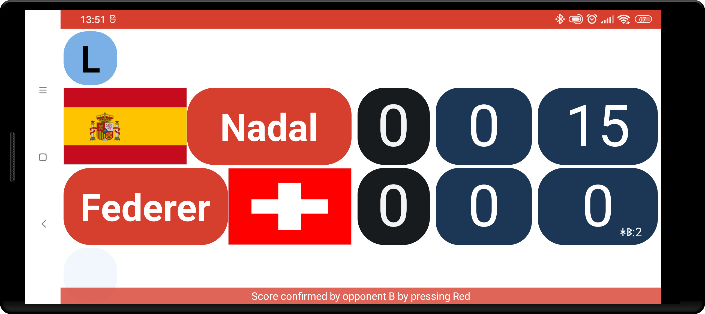
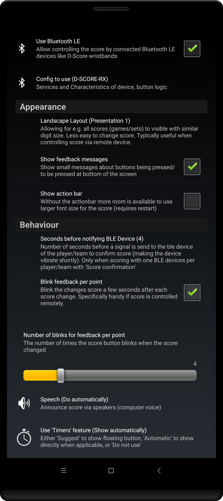

## Remote controlling the score

You can control the score with some bluetooth LE devices.
Special attention as been given to making the app work with the D-SCORE wristbands.

### One or two wristbands

There are several configuration options
- One wristband
    - one player is responsible for scoring for both players, 'green' button for one player/team, the 'red' button for the other
    - pressing both buttons will undo the last entered score
- Two wristbands, one per team :
    - Either 
        - one team/player indicates 'I/We scored' with the 'green' button, then
        - other team confirms ('Yes, they scored') with the 'red' button
        - or other team rejects ('No, they did not score') with the 'green' button
    - or 
        - one team/player indicates 'Opponent scored' with the 'red' button, then
        - other team confirms ('Yes, we scored')  with the 'green' button
        - or other team rejects ('No, we did not score') with the 'red' button
    - This is to prevent accidentally entering a score (deliberate accidental scoring is better known as 'cheating')
    - pressing both buttons will undo the last entered score. 
        - Again, to prevent 'cheating', undo will only work if initiated from the device of the player/team for which the last score was recorded in the app

### Scoring with the connected devices

The app will provided feedback for what 'stage' the scoring mechanism is in
- confirmation
    - the score button of the player for which scoring is to be confirmed will 'pulsate'

    - after 4 seconds (configurable in the `Settings > Bluetooth LE`) of not receiving a confirmation (or cancellation) the app will send a signal to the BLE device of the team that is to confirm to score, this typically makes that device vibrate shortly

- once confirmed, the score button of the scoring player will 'blink' a few times

### Connecting devices

To start using BLE devices, you need to scan for and connect them to the app:
- select the menu option 'BLE devices'
- Press 'Start Scan' to actually start scanning for devices (the app needs, and therefor may ask for, certain permission to be granted)
    - if an error about missing permissions is shown you will need to grant some permissions manually. This is typically done with steps along this line:
        - long click the app icon and select 'App info'
        - in the next screen select 'App permissions'
        - select and allow 'Nearby Devices' as well as 'Location' for the app
    - if scanning starts but no devices seem to show up
        - your devices might currently not be 'broadcasting' their presence
          - for e.g. D-Score devices, you might need to 'wake' them by pressing the green button
        - your devices might already be connected to another app or device (a 'connected' BLE devices does not 'broadcast' their presence)
- In the list of devices that show up
    - select the device you want to use for scoring by team A
    - select the device you want to use for scoring by team B
    - Note: depending on the used 'BLE' configuration (Setting > Bluetooth LE > Config to use) 
        - you can select the same device or two different devices for team A and B
        - you can only select the same device for both team A and B
        - you can only select different devices for team A and B
- once a checkbox is checked for both A and B, press the button on the bottom of the screen to actually start scoring with the BLE wristband(s)

If BLE devices are connected to the app, by default information 
- about the connections status, and 
- messages received and how the affected the score
are displayed at the bottom of the screen.

If these information messages are undesired, they can be turned off in the `Settings > Bluetooth LE` section.

### Achieving the best experience with scoring via BLE

To have the best experience with scoring via BLE devices it is probably best adapting the following settings
- Landscape Layout: one of the 'Presentation' options in stead of the `Default`
- Show action bar: best turned off off to have more room to show the score
- Use 'Timers' feature: Either `Automatically` or `Do not use`. Best not use `Suggest` 
- Changes sides feature: `Don't`

These can all be changed in the specially created `Settings > Bluetooth` LE section

