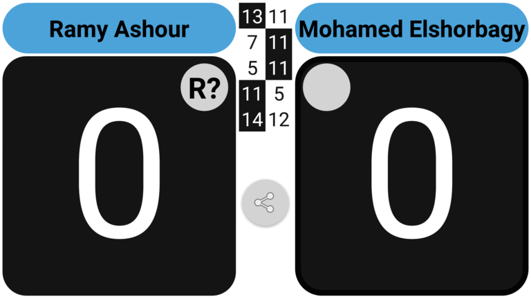
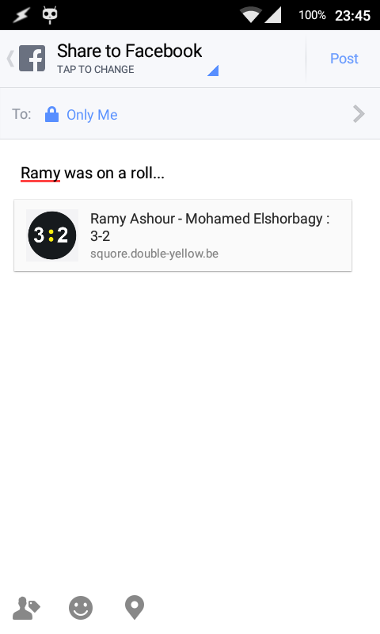
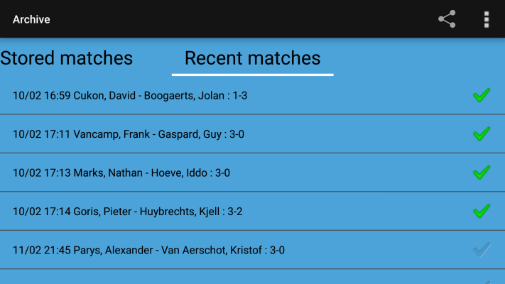

## Sharing

When the match has come to an end, a floating 'Share' button will appear:

If a user clicks on the share link, this user can consult the entire scoring history.
An example of what a user can see looks like this:

If they open the shared link on the device with Squore installed, they user has the option to open the URL with Squore (in stead of with a browser).
If he/she chooses to do so, the match details will be downloaded and can be viewed with the Squore app.

### Share on Facebook

If decide to use facebook for sharing the link, it will typically look like this.

### Share URL by email

In stead of sharing the link on e.g. facebook, you can also _share_ it by mailing the link to e.g.
* the players involved in the match
* the tournament organization the match is played in

### Share multiple matches at once

If for example your club has played against another club and all matches were reffed with Squore, preferrable with the same device, you can share a summary of all matches in one single mail or whatsapp message.
You can do this by selecting `Stored Matches` from the menu, go to the tab `Recent matches` were you are presented with recent matches and checkboxes behind each match.

Check the 'related' matches and press the `Share button`.
A message similar to this one will be composed for sharing e.g. by email or whatsapp.

    Event: VSF Interclub 2016-2017 3D Heren 
    Date: 10/02/2017
    
    Cukon, David - Boogaerts, Jolan : 1 - 3
    11/7 7/11 3/11 8/11  in 30 min
    
    Vancamp, Frank - Gaspard, Guy : 3 - 0
    11/3 11/8 11/9  in 23 min
    
    Marks, Nathan - Hoeve, Iddo : 3 - 0
    11/2 11/3 11/4  in 27 min
    
    Goris, Pieter - Huybrechts, Kjell : 3 - 2
    15/13 14/16 14/16 15/13 11/2  in 46 min
    
    
    De Vaart vs Double Squash Skills
    Matches: 3/1
    Games: 10/5
    Points: 180/129

#### Post match results to a website

At the end of a match (or even during a match) you can send the score currently on the board to a website.
If you specified a 'POST Url' in the preferences/settings screen, the following data will be posted to that URL.

    eventname=[event name of the match]
    eventdivision=[name of the division in which the match was played]
    eventround=[name of the round for which the match was played]
    location=[location where the match was played]
    whendate=[date in yyyy-MM-dd format]
    whentime=[time in HH:mm timezone format]
    player1=[name of player 1]
    player2=[name of player 2]
    result=[# of games won by player 1]-[# of games won by player 2]
    gamescores=[comma separated list of game scores]
    winner=[name of winner]
    duration=[duration of the match in minutes]
    totalpointsplayer1=[total # of points won by player 1]
    totalpointsplayer2=[total # of points won by player 2]

A typical example would look like this

    eventname=Boast Busters Tournament
    eventround=Round 2
    whendate=2014-12-01
    whentime=10:30+01:00
    player1=Harry P
    player2=Ron W
    result=3-1
    gamescores=11-5,6-11,11-2,12-10
    winner=Harry P
    duration=49
    totalpointsplayer1=40
    totalpointsplayer2=28

For demo purposes this URL is filled with a demo url that simply echo's what was posted.
The PHP 'code' of this demo URL simply looks like this:

    <?php
    print "Following post result was received at the demo url http://$_SERVER[HTTP_HOST]//$_SERVER[REQUEST_URI]";
    ksort($_REQUEST);
    print_r($_REQUEST);
    ?>

It is possible to have even more detailed posted. This can be achieved by selecting the option to post JSON data.
Literally all data about the match as stored by the app is then posted to the website.

In the settings there is an option 'Internet/Determine what data is posted'.
Here you can select
*   _Post most relevant data_: no JSON data is posted, 'only' details as in the examples above
*   _Post most relevant data + json_: next to data as above another parameter called 'json' is posted containing the JSON string
*   _Post only JSON data_: the body of the post contains just the JSON data (from which all other data can be deduced)

If you choose the last option you have e.g. the possibility to store the json file on you own server by using e.g.

    <?php
    $entityBody = file_get_contents('php://input');
    $jsonMatch = json_decode($entityBody);
    $players   = $jsonMatch->{'players'};
    $names     = $players->{'A'} . ' - ' . $players->{'B'};

    file_put_contents($names . '.json', $entityBody, LOCK_EX + FILE_TEXT))
    ?>

### Send result by SMS/Text

At the end of a match (or even during a match) you can send the score currently on the board by SMS/Text.
If you specified a 'preferred' number in the preferences/settings screen, this 'target' number will be used
as the default recipient.

A typical example of such a text message would be something like this:

    Raneem El Welily - Joelle King : 3 - 1

    11-6
    5-11
    11-7
    11-7

### Send scoresheet by Email

The result of a match can also be emailed to someone. The default email address used when you choose the menu option
'Share/Email match result' can be configured in the 'Settings/Sharing/Default email address' preference.

The subject of the email will be the result in the match, e.g: `Raneem El Welily - Joelle King : 3 - 1`

The email body by default contains the entire scoring history in plain text. Like this:

    =====================================
    | R 1--- | R 1--- | - 1L-- | R 1--- |
    | L--- 1 | L 2--- | R 2--- | L 2--- |
    | - 2R-- | R--- 1 | L--- 1 | R--- 1 |
    | R--- 2 | - 3R-- | - 3L-- | ---R 2 |
    | ---R 3 | R--- 2 | R--- 2 | - 3L-- |
    | ---L 4 | ---R 3 | ---L 3 | R--- 3 |
    | - 3R-- | - 4L-- | ---R 4 | ---R 4 |
    | R--- 5 | R--- 4 | - 4L-- | - 4L-- |
    | ---L 6 | - 5R-- | R 5--- | R 5--- |
    | - 4R-- | R--- 5 | L 6--- | L--- 5 |
    | R 5--- | ---R 6 | R 7--- | ---R 6 |
    | L--- 7 | ---L 7 | L--- 5 | ---L 7 |
    | ---R 8 | - 6R-- | - 8R-- | - 6R-- |
    | ---L 9 | R--- 8 | R--- 6 | R 7--- |
    | - 6R-- | - 7R-- | ---L 7 | L--- 8 |
    | R 7--- | R--- 9 | ---R 8 | ---R 9 |
    | L 8--- | ---R10 | - 9L-- | - 8L-- |
    | R 9--- | ---L11 | L10--- | R 9--- |
    | L10--- | ______ | R11--- | L---10 |
    | R11--- | ______ | ______ | -10R-- |
    | ______ | ______ | ______ | R---11 |
    | ______ | ______ | ______ | -11R-- |
    | ______ | ______ | ______ | R12--- |
    | ______ | ______ | ______ | L13--- |
    =====================================
    |*11-09  | 07-11* | *11-08 | *13-11 |
    -------------------------------------
    | *1 - 0 | 1 - 1* | *2 - 1 | *3 - 1 |
    -------------------------------------
    | T04:25 | T06:24 | T10:43 | T10:05 |
    =====================================

You have the option to disable this in the preferences screen.
If disabled, the email will contain a message similar to the SMS/Text message.

If you want to share more details about the match, the preferred way is to share the match URL like described earlier.

