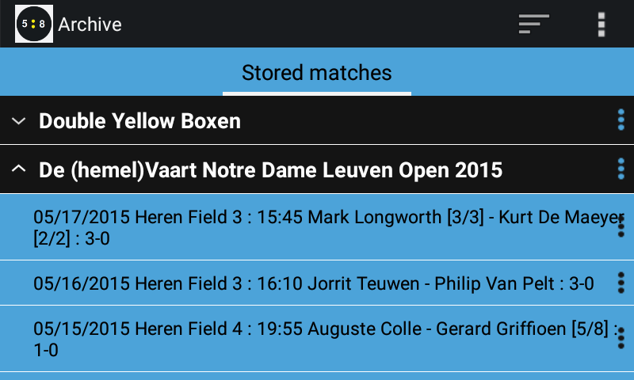
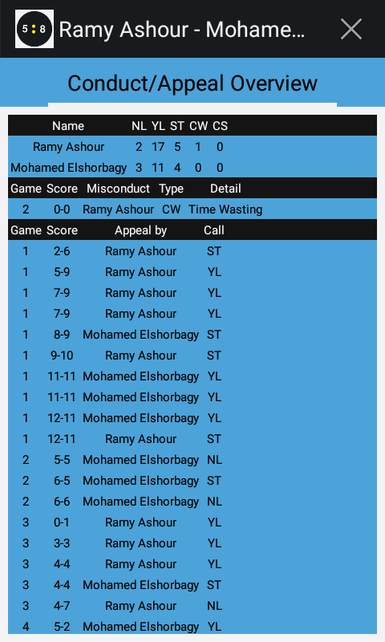
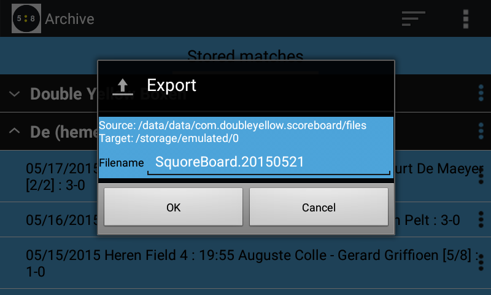
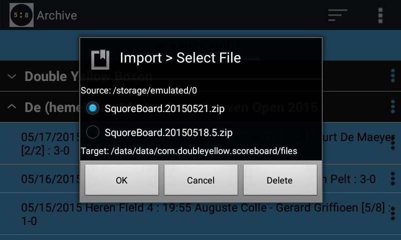

## Saving

As soon as you exit the app, the current score is always saved.
If you restart the app the last score is shown again, complete with possible already finished games.

So no worries if your phone rings, or other apps popup over the score board.
The score is saved.

The score is even persisted in such a way that you can retrieve it later if necessary.
E.g. if you need the score details to be noted down on some official scoring paper.

### Results of previous matches

All results are stored. So all matches you reffed can be 'recalled'.
Simply select the 'Show/Stored matches' menu option.

The stored matches will be presented to you.
All matches for which no event details were specified are sorted by date.
All other matches can either be sorted by date or by the name of the event.

Here you can simply select the match for which you want to see the details.

If the list contains an 'unfinished' match, you can select 'Open' from the popup menu in order to open that match in the actual score board.

If the list with stored matches is becoming to long you can delete some or all items from the list.
But also note that it is possible to backup all stored matches into a zip file by using the 'Export' menu option.

It is also possible to perform a text search in the 'Stored' matches to quickly locate e.g. all matches from a certain player.

### Review

All conducts as well as appeals and decisions you made can be viewed by selecting 'Show/Score Details' (or clicking on the scores of already finished games)
and in the screen that appears navigate to the 'Conduct/Appeal Overview' tab.

## Export/Import

If you can choose the 'Export' menu option from the 'Stored Matches' tab.

A zip file with all details of all of the listed matches is created.
The app will create it on your internal or external SD card, depending on the settings you selected under 'Settings/Archive/Directory for Import/Export.
(External SD card ofcourse only being available if you actually have one in your device).

Using this options allows you

- to transfer matches to another device
- restore the matches on the same device if you choose to uninstall and later re-install the Squore app.

If you choose the 'Import' menu option from the 'Stored Matches' tab, the app will present you with a dialog
listing all zip files that have importable data in them.

It is up to you to select the file you actually want to use.
All matches stored in that zip-file will be 'imported' into the Squore app and will appear in the 'Stored Matches' tab from now on.

A typical location for the zip-file is `/storage/emulated/0` (Internal Storage) or `/storage/sdcard1` (External Storage)

