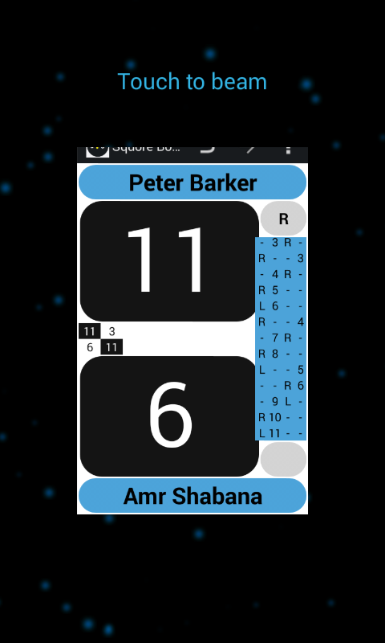

##Important

>Nfc as a method to transfer data has been removed by google in the latests SDK. So I had to remove this functionality from the more recent versions of this app.

## Transfer an in progress match

Suppose you are in the middle of reffing a match and something comes up, and you would really appreciate it if for example a
fellow club member continues reffing the match.

If this fellow club member also has this app installed, you can simply transfer the 'in progress' match to his device
using NFC (Near-Field-Communication), also referred to as S-Beam (Samsung) or Android Beam.

For this to work you must enable/turn on the NFC/S-Beam/Android beam feature of both the phones involved. (Typically under `Settings` and then in the section `Wireless & networks` choose `More...`)
* Simply bring your phone (with the Squore main screen as the active app) and the other phone back-to-back
* If it is enabled on both phones, NFC/Android-Beam will automatically kick in.
* Simply click on the screen of the device with the in progress match to confirm that you want to transmit data
* The match should now be transferred to the others persons device
    (If he does not have the Squore app installed, google play will be started suggesting to install the app).

This process can also be used to transfer already finished matches.
This allows you e.g. to transfer a match you played yourself but that was reffed by a someone using the Squore app, to your own phone, allowing you to see statistics about your own games.

