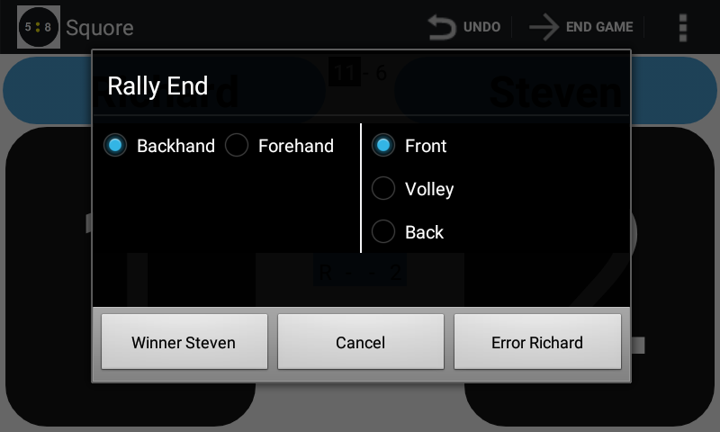
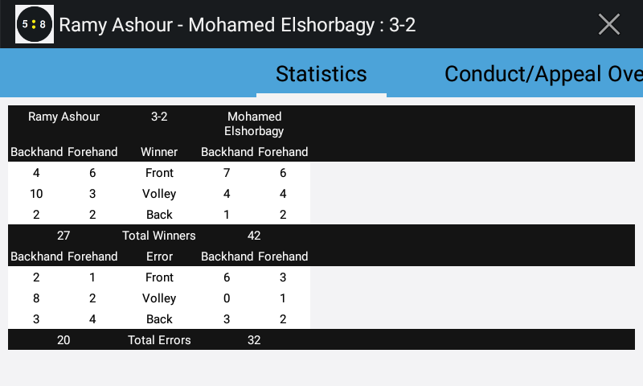

## Statistics

### Recording winners/errors

If you are interested in Winner/Error statistics (Forehand/Backhand Front/Volley/Back) similar to those presented e.g. on PSA Squash TV, you can configure
the app to come up with a pop-up after each change in score.

As a referee, your job is to keep an eye on the match.
Squore helps you with this since you need less time to write score details and or keep track of time.
So entering Winner/Error details usually is not done by the referee.
But you can ask e.g. a friend/coach or other spectator to use the app to record these statistics.

### Consulting the statistics

The statistic details can be consulted in one of the tabs when you select 'Match Details'.

