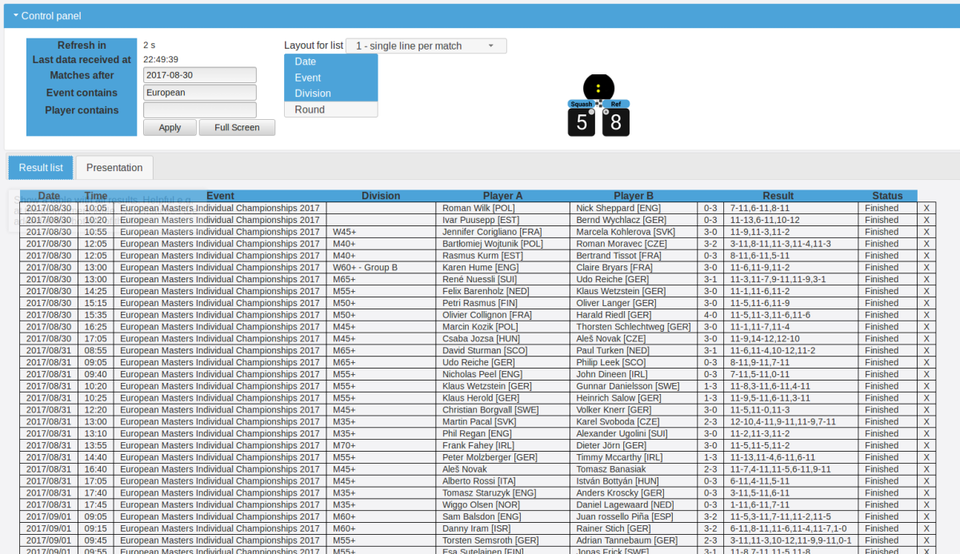
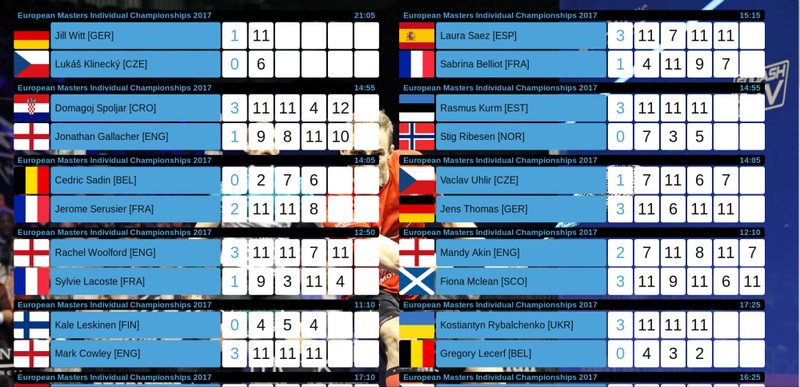

## Live score

Because a match that is shared with Squore is stored on the Squore server, it is possible to have semi-live scoring in a web page.
This is especially handy if a lot (or preferably all) of the matches in your tournament are reffed using Squore.

The experience is even better if you configure each device more specifically for 'Live Score Support'.
You can simply do this in the settings screen by choosing 'Live Score / Chrome Cast' and than 'Support live scoring'.

After choosing this option:
* the 'Share' feature of Squore is set to 'Automatic', and
* the score sheet of the match is shared (updated) to the server after each game

The persons responsible for the tournament schedule can now follow the progress of all matches via <http://squore.double-yellow.be/live>

This allows the persons responsible for the tournament to e.g. easily identify which match will be finished soon, and assure that players of upcoming matches can be notified up front. 

And if you like you can publish a link to a more 'fancy page' with all the scores using the 'Presentation' tab.
Several options appear there to control you how the matches will look on the page.
- background photos
- colors
- layout

If you have a layout to your liking, it is good practice to select 'Apply' or even 'Apply and Fullscreen'.
By pressing apply the URL in your browser will be converted to a link that contains all the customizations you made.

Because all matches reffed with the app anywhere in the world might appear on this page there is the option for you to filter:
- by event name
- by device id ( to have only matches appear that are reffed with certain devices. The LiveScore ID of a device can be found in Settings > Live Score > Device Unique Id (as of version 4.38)
- by player names
- by referee
- by court number
- how many days back

Here are a few links that list all matches of tournaments that were all reffed using Squore and using the 'Live Score' option:
* [Falcon PSA Squash Cup Open 2018 - Minsk, Belarus](http://squore.double-yellow.be/live?fullscreen=true&after=2018-02-15&eventContains=Falcon+PSA)
* [German Nationals 2018 - Hamburg, Germany](http://squore.double-yellow.be/live?hideColumns=eventBig&after=2018-02-15&eventContains=Einzelmeisterschaften)
* [European Masters 2017 - Hasta la Vista, Wroclaw, Poland](http://squore.double-yellow.be/live?after=2017-08-30&eventContains=European&activeTab=tabBig&fullscreen=true)
* [Double-Yellow Open 2017 - Mechelen, Belgium](http://squore.double-yellow.be/live?after=2017-04-29&eventContains=Double&activeTab=tabBig&fullscreen=true)
* [Open Interne - Val De Reuil](http://squore.double-yellow.be/live?after=2017-06-13&eventContains=Open+Interne)
* [2em eco-open des Amazones 2017 - Val De Reuil](http://squore.double-yellow.be/live?after=2017-06-02&eventContains=eco)
* [De (Hemel)Vaart Notre Dame Leuven Open 2017](http://squore.double-yellow.be/live?after=2017-05-24&eventContains=Vaart)
* [eco open des Amazones 2016 - Val De Reuil](http://squore.double-yellow.be/live?after=2016-06-04&eventContains=eco)
* [De (Hemel)Vaart Notre Dame Leuven Open 2016](http://squore.double-yellow.be/live?after=2016-05-05&eventContains=Vaart)
